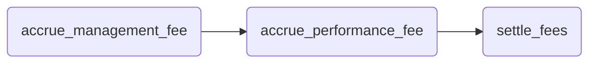

# 핵심 로직 다이어그램

이 문서는 Vault 입출금 과정과 수수료 정산 순서를 도식화하여 보여 줍니다.

## 1. 입금 처리 흐름

```mermaid
flowchart TD
    A["사용자 호출 deposit(amount)"] --> B["load_state()"]
    B --> C["update_fees(state)"]
    C --> D[fee = amount * SPREAD_RATE]
    D --> E[net_amount = amount - fee]
    E --> F[asset_price = get_price(DEP_ASSET)]
    F --> G{총 지분 > 0?}
    G -- 네 --> H[share_price = NAV / 총 지분]
    G -- 아니오 --> I[share_price = asset_price]
    H --> J[new_shares = (net_amount * asset_price) / share_price]
    I --> J
    J --> K[state.total_assets += net_amount]
    K --> L[state.total_shares += new_shares]
    L --> M["save_state(state)"]
    M --> N["log_transaction('deposit')"]
```

## 2. 출금 처리 흐름

```mermaid
flowchart TD
    A["사용자 호출 withdraw(shares)"] --> B["load_state()"]
    B --> C["update_fees(state)"]
    C --> D{shares ≤ 총 지분?}
    D -- 아니오 --> Z[오류 반환]
    D -- 네 --> E[asset_price = get_price(DEP_ASSET)]
    E --> F[share_price = NAV / 총 지분]
    F --> G[amount = shares * share_price / asset_price]
    G --> H[fee = amount * SPREAD_RATE]
    H --> I[net_amount = amount - fee]
    I --> J[state.total_assets -= net_amount]
    J --> K[state.total_shares -= shares]
    K --> L["save_state(state)"]
    L --> M["log_transaction('withdraw')"]
```

## 3. 수수료 정산 순서

`update_fees(state)` 호출 시 내부적으로 다음 단계가 실행됩니다.


